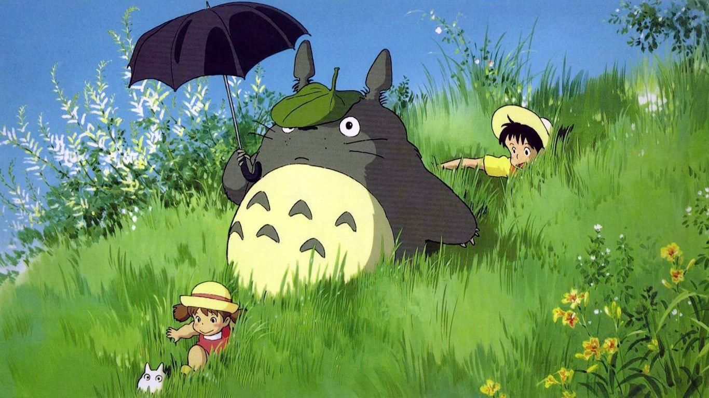

# 🌱 cozy terminal

A gentle, good-looking terminal setup for someone just getting started — a
Studio-Ghibli *Totoro* theme (forest greens & warm cream), the friendly
**fish** shell, and a cute **starship** prompt. One command sets it all up.



## Install

On a Debian/Ubuntu machine, from inside this folder:

```bash
./install.sh
```

That's it. It will:

1. install **kitty** (the terminal), **fish** (the shell), and **starship** (the prompt)
2. install the **JetBrains Mono Nerd Font** (so all the little icons show up)
3. apply the **Totoro** colour theme, with a dimmed Totoro *behind* your text
4. set kitty to open **fish + starship** for you — no matter your current shell
5. copy the full-brightness Totoro wallpaper to `~/Pictures` for your desktop
6. offer to also make fish your everyday shell everywhere

It's safe to run more than once — it skips anything already installed and backs
up any file it would replace (as `name.bak.<date>`).

Want to see what it does first, without changing anything?

```bash
./install.sh --dry-run
```

## After installing

- Open **kitty** — that's your new terminal. It opens **fish + starship**
  automatically, so you get the cute prompt even if your system shell is zsh.
- If kitty was already open when you installed, **fully quit and reopen it**.
- fish shows grey **autosuggestions** as you type — press **→** to accept one.

## Making it yours

| I want to…            | Do this |
|-----------------------|---------|
| change the colours    | edit `~/.config/kitty/totoro.conf` and save — it updates instantly |
| see Totoro more / less | edit `background_tint` in `~/.config/kitty/kitty.conf` (lower = more Totoro, higher = crisper text) |
| make text bigger/smaller | press `Ctrl +` / `Ctrl -` (`Ctrl 0` resets) |
| change the font size permanently | edit `font_size` in `~/.config/kitty/kitty.conf` |
| tweak the prompt      | edit `~/.config/starship.toml` |
| add a shortcut/alias  | edit `~/.config/fish/config.fish` |

## What's in this folder

```
install.sh          the one command
lib.sh              helpers the installer uses
kitty/kitty.conf    the terminal settings (opens fish, shows the wallpaper)
kitty/totoro.conf   the colour palette
kitty/totoro-bg.jpg the dimmed Totoro shown behind your text
starship/starship.toml   the prompt
fish/config.fish    shell greeting, prompt hookup, and shortcuts
wallpaper/          the full-brightness Totoro wallpaper for your desktop
```
